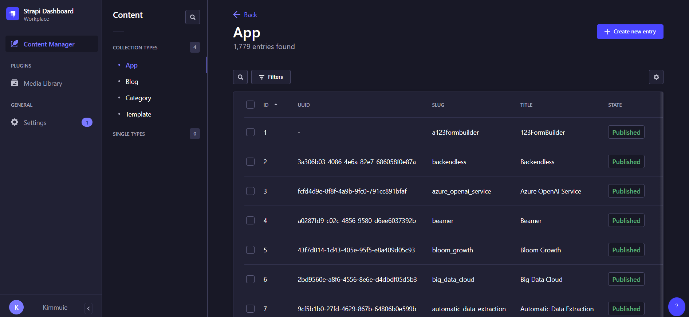
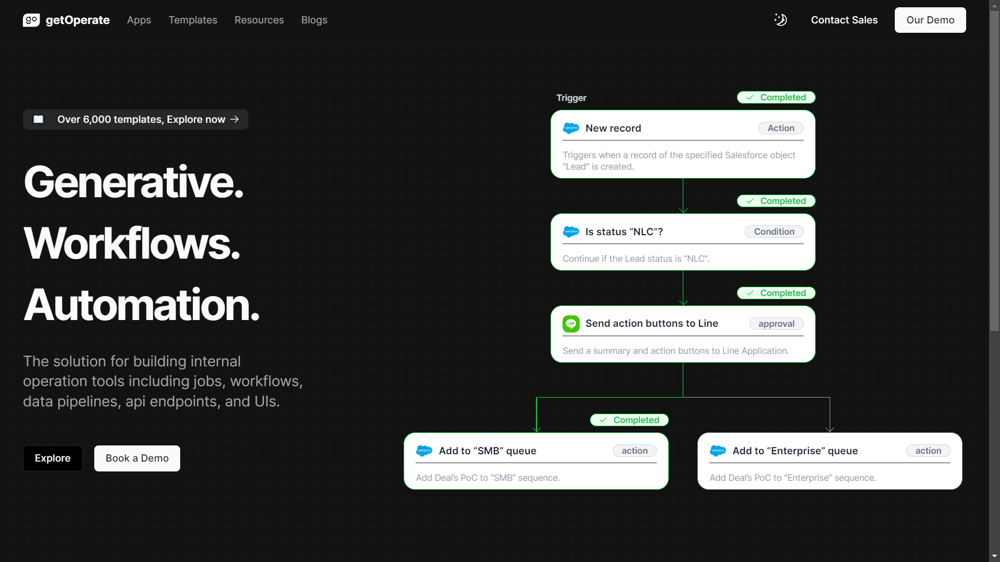
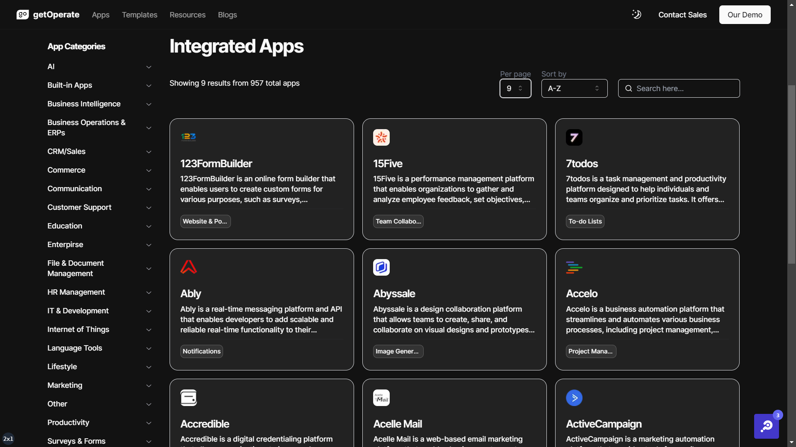
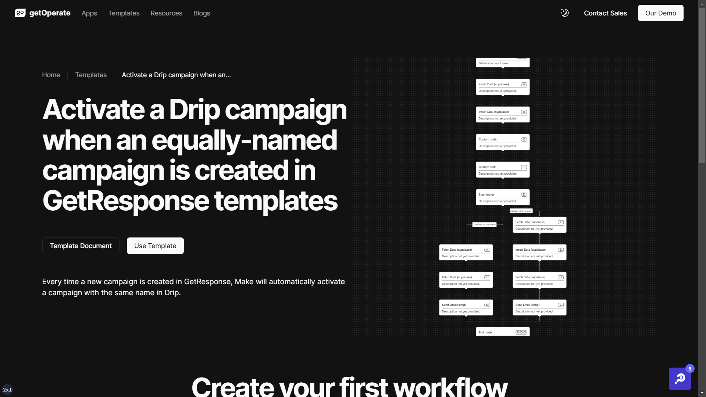

# getOperate

### What is getOperate?
**getOperate** is a comprehensive platform designed to streamline internal operations by offering a range of tools and features. It provides over 6,000 templates for users to explore and offers generative workflows, allowing users to create custom workflows using a visual builder with drag-and-drop functionality. The platform emphasizes automation, enabling users to automate tasks and processes, from simple actions to building entire automated systems. Integration with Salesforce allows for triggers and actions, such as responding when a new record is created. Additionally, there's integration with application for sending summaries and action buttons for approval. Users can customize workflows according to their specific business needs.
The getOperate tool is developed by [dData](https://th.linkedin.com/company/ddataco) the company where **I interned from 18 March to 30 April in 2024**. I participated in its development, and the repository will showcase my contributions. However, please note that not all files are displayed due to restrictions.
   
**getOperate** เป็นแพลตฟอร์มที่ครอบคลุมซึ่งออกแบบมาเพื่อปรับปรุงกระบวนการภายในโดยนำเสนอเครื่องมือและคุณลักษณะต่างๆ โดยมีเทมเพลตมากกว่า 6,000 แบบให้ผู้ใช้งาน และยังมีเวิร์กโฟลว์ที่ช่วยให้ผู้ใช้สร้างเวิร์กโฟลว์แบบกำหนดเองได้โดยใช้ตัวสร้างภาพพร้อมฟังก์ชันลากและวาง แพลตฟอร์มนี้เน้นที่การทำงานอัตโนมัติ ช่วยให้ผู้ใช้ทำงานและกระบวนการต่างๆ โดยอัตโนมัติ ตั้งแต่การดำเนินการง่ายๆไปจนถึงการสร้างระบบอัตโนมัติทั้งหมด การบูรณาการกับ Salesforce ช่วยให้สามารถทริกเกอร์และการดำเนินการต่างๆ เช่น การตอบสนองเมื่อมีการสร้างระเบียนใหม่ นอกจากนี้ยังมีการบูรณาการกับแอปพลิเคชันสำหรับการส่งสรุปและปุ่มการดำเนินการเพื่อขออนุมัติ ผู้ใช้สามารถปรับแต่งเวิร์กโฟลว์ตามความต้องการทางธุรกิจเฉพาะของตนได้
เครื่องมือ getOperate ได้รับการพัฒนาโดยบริษัท [dData](https://th.linkedin.com/company/ddataco) ซึ่งเป็นบริษัทที่ผม นายปรานต์ชยุต เนตรสว่าง **ได้ฝึกงานตั้งแต่วันที่ 18 มีนาคมถึง 30 เมษายน 2024** โดยที่ผมมีส่วนร่วมในการพัฒนาต่างๆมากมาย ซึ่งสามารถดูสิ่งที่ผมทำได้ภายในไฟล์ที่ถูกจัดเก็บในนี้ แต่อย่างไรก็ตามโปรดทราบว่ามีเพียงบางไฟล์เท่านั้นที่ถูกแสดงภายในนี้เนื่องจากมีข้อจำกัดต่างๆ
 
 
 
### Participated Contributions List
- Integrated Apps Data
- Extract Template Data from CMS
- Pagination
- Navigation
- Catogories&Templates&Blogs Sort
- Catogories&Templates&Blogs Search
- Categories&Templates&Blogs GoCard
- Categories&Templates&Blogs Internal site
- Catogories&Templates Filter
- Markdown

### Used Language/Tools

  &nbsp;
  &nbsp;
  &nbsp;
  &nbsp;
  &nbsp;
  &nbsp;
  &nbsp;

   

You can take a look at [getOperate](https://getoperate.com/) workflow. Currently developer of this workflow is [Mr. Prayong Nooyen](https://www.linkedin.com/in/prayong/), he is also my mentor of internship.

###  Participated Contributions / Website Interface

  
  
  
  

