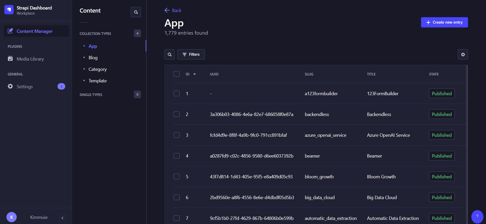
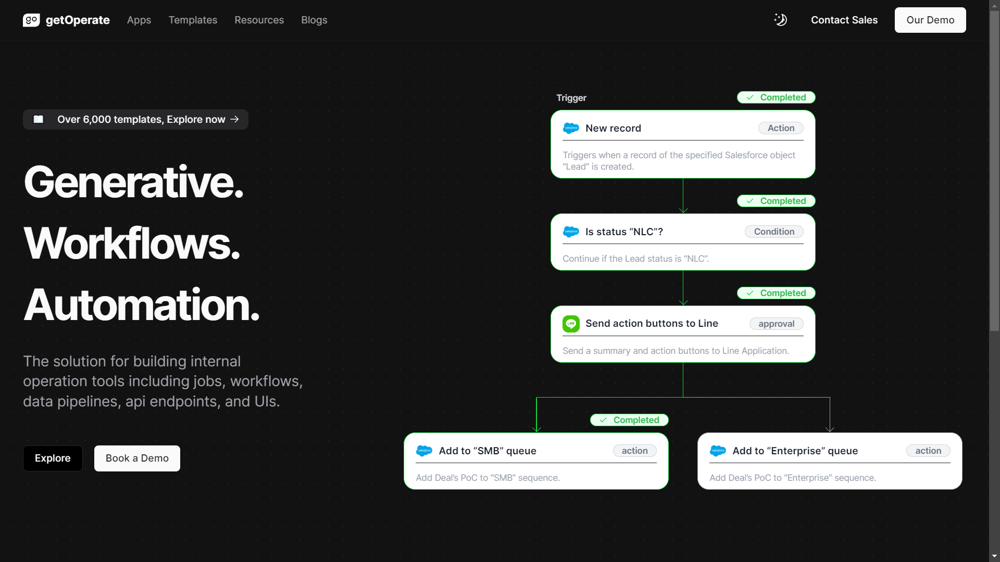
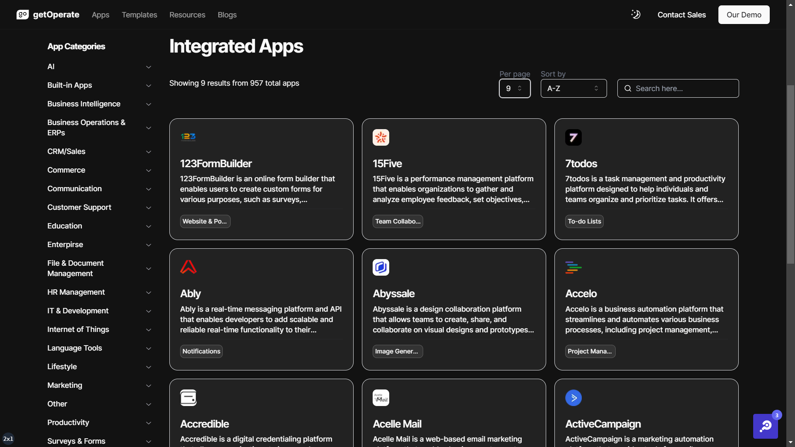
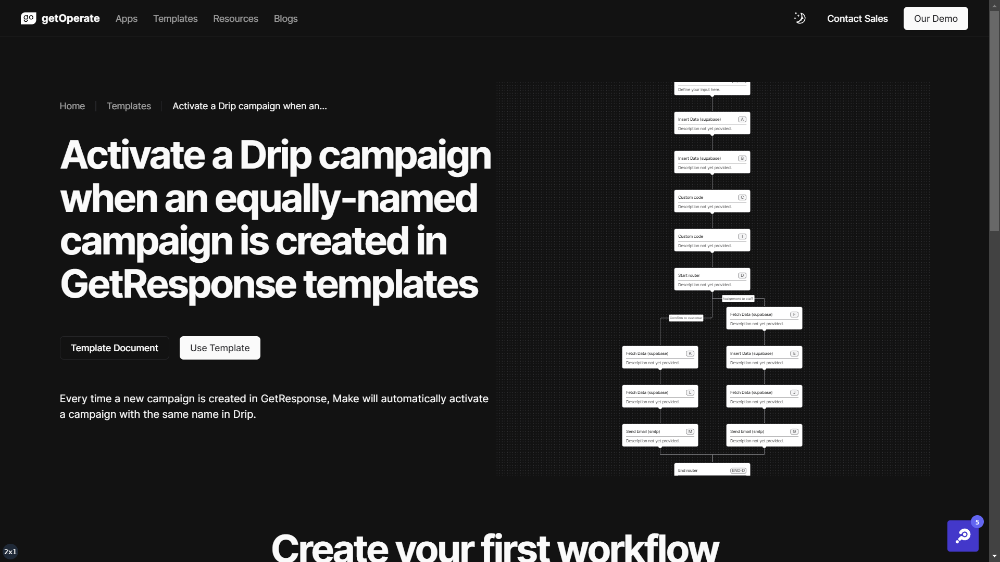

# 💼 getOperate (Internship Contributions)

  

  
  
  

---

## ✨ Overview

**getOperate** is an enterprise workflow automation platform developed by **dData**, providing businesses with tools to build, customize, and automate internal processes.

The platform offers **6,000+ workflow templates**, a visual drag-and-drop workflow builder, and integrations with external services such as Salesforce. Organizations can automate repetitive tasks, create approval flows, and build custom business processes without developing everything from scratch.

This repository **does not contain the complete source code** of getOperate. Instead, it showcases the work I contributed during my internship at **dData** from **18 March – 30 April 2024**. Due to company confidentiality and intellectual property restrictions, only selected files and features that I worked on are included.

## 🏢 Internship

* **Company:** [dData](https://th.linkedin.com/company/ddataco)
* **Position:** Software Developer Intern
* **Duration:** 18 March – 30 April 2024
* **Mentor:** [Mr. Prayong Nooyen](https://th.linkedin.com/in/prayong?trk=org-employees)

The internship provided hands-on experience in developing production-level enterprise software, collaborating within a professional development team, and working with CMS-driven applications and modern web technologies.

## 👨‍💻 My Contributions

During my internship, I participated in developing several parts of the platform, including:

| Area                    | Contribution                                                         |
| ----------------------- | -------------------------------------------------------------------- |
| **CMS Integration**     | Retrieved and displayed application and template data from the CMS.  |
| **Template System**     | Implemented template extraction, categorization, and rendering.      |
| **Pagination**          | Developed pagination for large collections of templates and content. |
| **Navigation**          | Improved website navigation and routing.                             |
| **Search**              | Built search functionality for categories, templates, and blogs.     |
| **Sorting & Filtering** | Implemented sorting and filtering for categories and templates.      |
| **Internal Pages**      | Developed category, template, and blog detail pages.                 |
| **GoCard Components**   | Created reusable card components for content navigation.             |
| **Markdown Support**    | Added Markdown rendering for documentation and content pages.        |

## 🌐 Official Website

Learn more about getOperate:

**https://getoperate.com/**

The workflow automation system is currently developed by **Mr. Prayong Nooyen**, who also served as my mentor during the internship.

## 🖥 Built With

<table>
<tr align="center">
<td width="90">

</td>

<td width="90">

</td>

<td width="90">

</td>

<td width="90">

</td>

</tr>

<tr align="center">
<td>Next.js</td>
<td>Tailwind</td>
<td>TypeScript</td>
<td>Python</td>
</tr>
</table>

## 📸 Internship Contributions

<table>
<tr>
<td align="center">

 <b>CMS Integration</b>
</td>

<td align="center">

 <b>Templates</b>
</td>
</tr>
</table>

<table>
<tr>
<td align="center">

 <b>Search & Navigation</b>
</td>

<td align="center">

 <b>Content Pages</b>
</td>
</tr>
</table>

> **Note:** The screenshots and source code shown in this repository represent only the parts I contributed during my internship. The complete getOperate platform is proprietary software owned by **dData** and is not included in this repository.

## 📄 License

This repository is shared for portfolio and educational purposes only. Proprietary components and confidential company assets are intentionally excluded.
